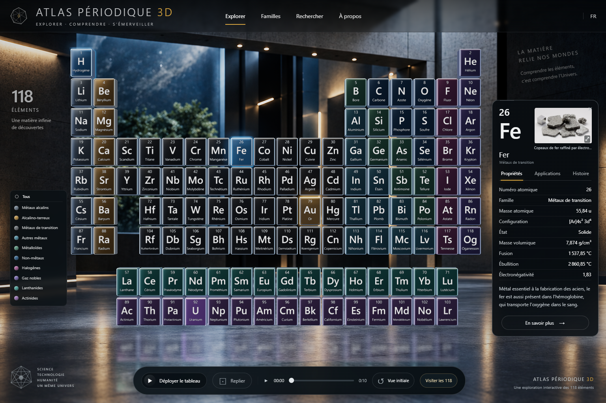

# Atlas Périodique 3D

**Un tableau périodique interactif en français pour explorer les 118 éléments chimiques.**

Atlas Périodique 3D présente le tableau de Mendeleïev sous la forme d’un musée numérique. Chaque case est sélectionnable : elle donne accès à une fiche de propriétés et à un visuel documenté de l’élément. Le tableau est rendu en 3D dans le navigateur, avec zoom, rotation limitée, sélection et animations de déploiement.

Vous pouvez chercher un élément précis, isoler une famille chimique ou suivre une visite automatique, de l’hydrogène à l’oganesson.



[Présentation du projet](https://giscolab.github.io/atlas-periodique/) · [Démarrer](#démarrer) · [Interagir avec le tableau](#interagir-avec-le-tableau) · [Sources et limites](#sources-et-limites)

> **La page de présentation et l’application sont différentes.** Le site de présentation décrit le projet et montre des captures. Pour manipuler le tableau 3D, lancez l’application contenue dans ce dépôt avec les instructions ci-dessous.

## Démarrer

### Ce qu’il faut

Python 3 et un navigateur récent avec JavaScript et le rendu WebGL activés. Les bibliothèques, le modèle 3D, les données et les visuels sont inclus dans le dépôt : **aucune installation npm, aucune clé API et aucun compte ne sont nécessaires pour utiliser l’application locale**.

### Sous Windows

1. Téléchargez le dépôt complet depuis GitHub, puis extrayez l’archive ZIP.
2. Ouvrez le dossier extrait et double-cliquez sur **`serve.bat`**.
3. Le navigateur s’ouvre automatiquement sur l’Atlas. Gardez la fenêtre du serveur ouverte pendant l’utilisation.

Le lanceur utilise le port `8084`, ou cherche un autre port disponible si celui-ci est occupé. L’adresse exacte est affichée dans la fenêtre du serveur.

### Depuis un terminal

Dans le dossier du projet :

```bash
python server.py --auto-port --open
```

Sur un système où Python 3 se lance avec `python3` :

```bash
python3 server.py --auto-port --open
```

Pour récupérer le projet avec Git plutôt qu’en ZIP :

```bash
git clone https://github.com/Giscolab/atlas-periodique.git
cd atlas-periodique
python server.py --auto-port --open
```

**N’ouvrez pas directement `index.html` par double-clic.** L’application charge des modules JavaScript, des données et un modèle 3D ; utilisez le serveur fourni.

Une fois le projet téléchargé, l’exploration locale fonctionne sans connexion Internet. Seule l’ouverture des liens vers les sources externes nécessite une connexion. Le serveur écoute sur `127.0.0.1` : il ne rend pas l’application accessible aux autres appareils du réseau. Pour l’arrêter, utilisez `Ctrl+C` dans sa fenêtre.

## Interagir avec le tableau

Pour une première découverte, ouvrez **Rechercher**, saisissez `Fer`, `Fe` ou `26`, puis choisissez le résultat. La fiche du fer s’ouvre. Cliquez sur son visuel pour l’agrandir, puis essayez **Visiter les 118** pour parcourir le reste du tableau.

### Les commandes essentielles

| Action | Comment faire |
| --- | --- |
| Identifier une case | Survolez-la pour afficher son numéro, son symbole et son nom. |
| Ouvrir une fiche | Cliquez sur une case. |
| Rapprocher une case | Double-cliquez dessus. |
| Changer légèrement l’angle de vue | Cliquez et faites glisser dans la scène. La rotation est volontairement limitée. |
| Zoomer ou dézoomer | Utilisez la molette de la souris. |
| Retrouver le cadrage de départ et le tableau assemblé | Cliquez sur **Vue initiale**. |
| Fermer une fiche | Cliquez sur **×**, ou appuyez sur **Échap** lorsqu’aucune fenêtre de dialogue n’est ouverte. |

### Rechercher un élément

Le bouton **Rechercher** ouvre une recherche par **nom français**, **symbole** ou **numéro atomique**. Les accents ne sont pas obligatoires : `etain` retrouve **Étain**.

Cliquez sur un résultat pour ouvrir sa fiche. Au clavier, la flèche bas permet d’atteindre les résultats ; les flèches haut et bas servent ensuite à les parcourir, et **Entrée** à choisir l’élément.

### Filtrer une famille chimique

Le bouton **Familles** affiche ou masque la légende. Cliquez sur une famille — par exemple **Gaz nobles**, **Halogènes** ou **Métaux de transition** — pour ne conserver que ses cases à l’écran.

Choisissez **Tous** pour réafficher les 118 éléments. **Vue initiale** restaure le cadrage, mais ne supprime pas un filtre de famille.

## Lire la fiche d’un élément

Chaque fiche rassemble son nom, son symbole, son numéro atomique, sa famille et trois onglets :

| Onglet | Contenu |
| --- | --- |
| **Propriétés** | Masse atomique, configuration électronique, état, masse volumique, températures de fusion et d’ébullition, électronégativité, selon les données disponibles. |
| **Applications** | Usages rédigés pour certains éléments ; sinon, invitation à consulter la source PubChem. |
| **Histoire** | Texte historique pour certains éléments ; sinon, indication de découverte issue des données disponibles. |

Un tiret **—** indique une valeur absente. Le lien **En savoir plus** ouvre la fiche PubChem correspondante.

**Les textes détaillés des rubriques Applications et Histoire sont actuellement rédigés pour le fer, l’or et l’uranium.** Les 118 éléments sont consultables, mais leurs contenus rédactionnels n’ont pas tous le même niveau de détail.

### Observer le visuel

Cliquez sur la vignette de la fiche pour ouvrir une vue agrandie avec sa description, son crédit, sa licence et sa source. Fermez-la avec **×** ou **Échap**.

La collection comprend **94 photographies et 24 schémas**, soit un visuel pour chacun des 118 éléments. Les légendes précisent ce qui est montré : échantillon, tube à décharge, solution ou autre situation documentée. Les schémas sont identifiés comme tels : ils indiquent le symbole et le nombre de protons, **pas l’apparence réelle d’un échantillon**.

## Suivre la visite des 118 éléments

Cliquez sur **Visiter les 118** pour lancer le parcours dans l’ordre des numéros atomiques, de **H — 1** à **Og — 118**. Le tableau reste assemblé et cadré ; la case active s’illumine, avance légèrement et ouvre sa fiche.

| Commande | Effet |
| --- | --- |
| **Pause visite / Reprendre la visite** | Suspendre ou poursuivre le parcours. |
| **‹ / ›** | Passer à l’élément précédent ou suivant ; la visite se met en pause pour permettre la lecture. |
| **Rapide / Normal / Lent** | Choisir une durée de 1,5, 3 ou 6 secondes par élément. |
| **Recommencer** | À la fin du parcours, repartir de l’hydrogène. |

La dernière fiche reste affichée à la fin de la visite.

**Vous gardez le contrôle :** ouvrir la recherche ou la présentation, interagir avec la fiche, agrandir un visuel ou quitter l’onglet du navigateur met la visite en pause. Sélectionner manuellement un élément, appliquer un filtre, manipuler la caméra ou utiliser les commandes d’animation l’interrompt.

## Déployer et replier le tableau

L’animation du tableau et la visite des éléments sont deux fonctions distinctes : la visite sert à lire les fiches ; le déploiement permet d’observer la mise en mouvement du tableau.

Utilisez **Déployer le tableau** pour ouvrir sa composition et **Replier** pour la rassembler. Le bouton **▶ / pause** contrôle la lecture de la séquence ; le curseur permet de choisir directement un moment de l’animation.

Pendant le déploiement, la fiche et la légende s’effacent pour dégager la scène. Cliquez sur **Replier** ou **Vue initiale** pour revenir à la consultation. Pour relire la séquence depuis le début, ramenez le curseur au départ ou utilisez **Vue initiale**, puis lancez la lecture.

## Sur petit écran et au clavier

Sur petit écran, la fiche et la légende ne sont pas ouvertes au démarrage. Utilisez **Rechercher** pour accéder directement à un élément et **Familles** pour afficher les filtres. Les inscriptions des cases étant petites, la fiche est le meilleur endroit pour lire leurs informations.

Les boutons, la recherche et les onglets de la fiche sont utilisables au clavier. Dans les onglets, les flèches gauche et droite changent de rubrique. **Échap** ferme les fenêtres de dialogue. La préférence système de réduction des animations est prise en compte.

Les vérifications documentées incluent une émulation mobile sous Chromium, **pas une validation sur téléphone physique**. Les performances et la compatibilité peuvent varier selon le navigateur et l’appareil.

## En cas de difficulté

| Problème | À vérifier |
| --- | --- |
| `python` n’est pas reconnu | Vérifiez que Python 3 est installé et accessible dans le terminal. Sous Windows, `serve.bat` utilise la commande `python`. |
| Le navigateur ne s’ouvre pas | Copiez l’adresse affichée dans la fenêtre du serveur et ouvrez-la dans le navigateur. |
| La page ne charge pas correctement | Lancez `serve.bat` ou `server.py`, plutôt que le fichier HTML directement, et vérifiez que tout le dépôt a été extrait. |
| Certaines cases ont disparu | Dans **Familles**, sélectionnez **Tous**. |
| La fiche a disparu pendant l’animation | Utilisez **Replier** ou **Vue initiale**. |
| Le cadrage ne convient plus | Cliquez sur **Vue initiale**. |

## Sources et limites

Les propriétés proviennent d’une copie locale de la [table périodique PubChem](https://pubchem.ncbi.nlm.nih.gov/rest/pug/periodictable/JSON), récupérée le **19 septembre 2026**. Les noms français proviennent des objets texte du modèle Blender d’origine. Les températures sont affichées en degrés Celsius.

Les valeurs dépendent de leurs conditions de mesure ; les états prévus de certains éléments restent signalés comme tels. L’Atlas est un outil de découverte et de consultation : pour les conditions expérimentales et la documentation détaillée, consultez les sources liées dans les fiches.

La vue principale associe **un tableau réellement rendu en 3D et un décor fixe**. Ce décor n’a pas de parallaxe : il ne s’agit pas d’un musée dans lequel on peut se déplacer librement. Une variante avec galerie entièrement modélisée est disponible en ajoutant `?gallery=3d` à l’adresse locale. La page locale `/comparatif.html` est destinée à la comparaison du rendu avec l’image de référence.

Les documents suivants conservent les crédits, les explications techniques et les preuves de validation :

- [Visuels des 118 éléments : descriptions, sources et licences](docs/SPECIMENS.md).
- [Textures de l’environnement](docs/ENVIRONMENT-SOURCES.md), [décor fixe](docs/ART-BACKPLATE.md) et [ancienne illustration du fer](docs/IRON-ASSET.md).
- [Géométrie et cadrage](docs/GEOMETRIE.md), [vérifications effectuées et limites connues](docs/VALIDATION.md).

## Repères techniques

L’application utilise **HTML, CSS, JavaScript et Three.js**, fourni localement dans `vendor/three`. `server.py` sert les fichiers ; aucun traitement scientifique côté serveur n’est nécessaire.

| Emplacement | Rôle |
| --- | --- |
| `index.html`, `styles.css` | Interface de l’application interactive. |
| `app.js` et les modules `.mjs` | Scène 3D, caméra, sélection, recherche, filtres, fiches et visite. |
| `assets/` | Modèle GLB, données des éléments, noms français et visuels. |
| `vendor/three/` | Bibliothèque Three.js et modules associés. |
| `server.py`, `serve.bat`, `serve.ps1` | Lancement du serveur local. |
| `docs/` | Site de présentation, captures et documentation. |

Le modèle `assets/periodic_table_v4.glb` conserve ses 118 racines d’éléments et ses 21 clips d’animation. L’apparence des cases et les inscriptions sont adaptées par l’application ; le rendu ne correspond donc pas à celui du modèle d’origine sans modification de présentation.

**Projet de Giscolab.** Les crédits et licences des ressources tierces sont détaillés dans les documents de sources ci-dessus.
